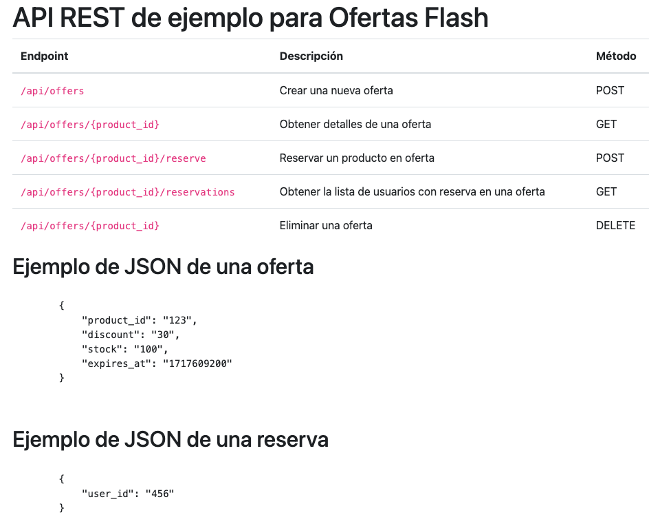
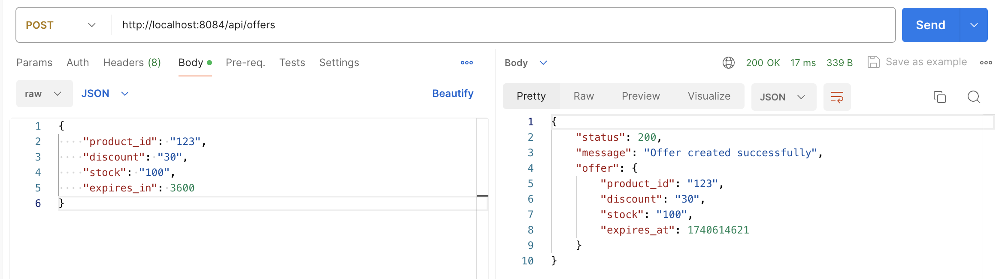
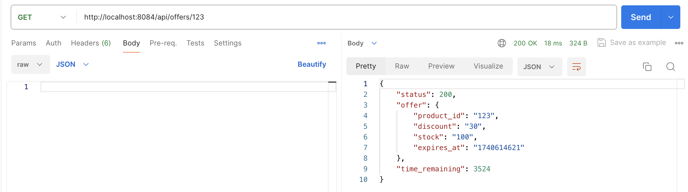
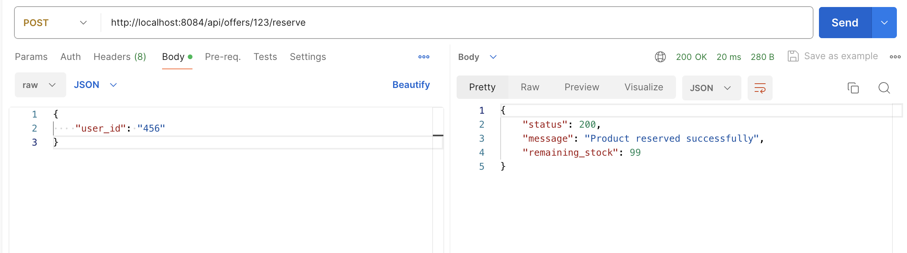
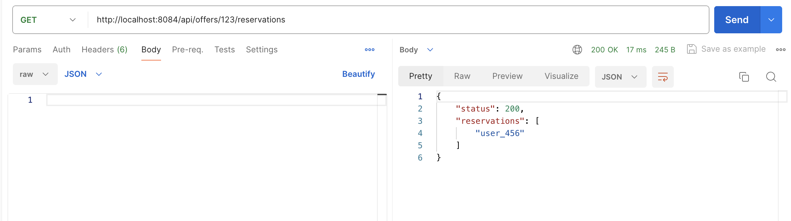
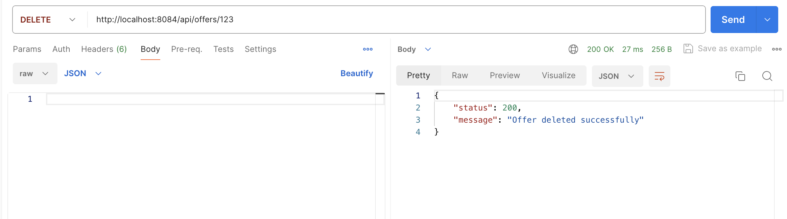

////
NO CAMBIAR!!
Codificación, idioma, tabla de contenidos, tipo de documento
////
:encoding: utf-8
:lang: es
:toc: right
:toc-title: Tabla de contenidos
:doctype: book
:linkattrs:

////
Nombre y título del trabajo
////
# Desarrollo de una API REST para gestión de ofertas flash con Slim Framework y Redis
Bases de datos a gran escala. Máster en Ingeniería Informática. Manuel Torres <mtorres@ual.es>

image::images/di.png[]

// NO CAMBIAR!! (Entrar en modo no numerado de apartados)
:numbered!: 

[abstract]
== Resumen
////
COLOCA A CONTINUACION EL RESUMEN
////
En este tutorial se muestra el desarrollo de una API REST para la gestión de ofertas flash utilizando Slim Framework y Redis. La API permite crear, obtener, reservar y eliminar ofertas flash, almacenando los datos en Redis. Se utiliza Docker y Docker Compose para configurar el entorno de desarrollo, y PHPRedis para interactuar con Redis desde la aplicación Slim. A lo largo del tutorial, se describen los pasos necesarios para configurar el entorno, implementar la API y probar los endpoints utilizando Postman. 

////
COLOCA A CONTINUACION LOS OBJETIVOS
////
.Objetivos

* Desarrollar una API REST utilizando Slim Framework y Redis para gestionar ofertas flash.
* Implementar operaciones CRUD (Crear, Obtener, Reservar, Eliminar) para las ofertas flash.
* Configurar un entorno de desarrollo utilizando Docker y Docker Compose.
* Utilizar PHPRedis para interactuar con Redis desde la aplicación Slim.
* Garantizar la consistencia de los datos en entornos de alta concurrencia mediante operaciones atómicas en Redis.
* Probar los endpoints de la API utilizando Postman.

[TIP]
====
Este proyecto es una continuación de https://github.com/ualmtorres/SlimHelloWorld[SlimHelloWorld] y el https://ualmtorres.github.io/howtos/RedisPHP/PHPRedisBasico/[Tutorial Uso básico de PHPRedis], y está disponible en https://github.com/ualmtorres/SlimRedisAPIOfertasFlash[este repositorio].
====


// Entrar en modo numerado de apartados
:numbered:

## Introducción

Las ofertas flash son una estrategia clave en el comercio electrónico moderno. Empresas como Amazon, AliExpress o eBay utilizan este tipo de promociones para generar urgencia y aumentar las ventas en períodos de tiempo reducidos. Sin embargo, la gestión eficiente de estas ofertas supone un desafío técnico:

* ¿Cómo aseguramos que el stock disponible se actualiza correctamente ante miles de reservas simultáneas?
* ¿Cómo evitamos sobreventas o reservas incorrectas en un sistema de alta concurrencia?
* ¿Cómo garantizamos que las ofertas expiren automáticamente cuando finaliza su tiempo de validez?

Redis es una excelente opción para abordar estos problemas gracias a su velocidad, capacidad de manejo de operaciones atómicas y soporte para la expiración automática de datos. En esta tarea, pondrás en práctica estas capacidades diseñando una API REST que administre ofertas flash en un entorno de comercio electrónico.

## Descripción del problema

En este proyecto, se va a desarrollar una API REST para gestionar ofertas flash en una tienda online utilizando Slim Framework, Redis y PHPRedis para interactuar con Redis desde Slim. La API debe permitir:

* Crear una nueva oferta flash con un producto, un descuento, un stock y un tiempo de expiración.
* Obtener detalles de una oferta flash, incluyendo el tiempo restante para que la oferta expire.
* Reservar un producto en oferta, disminuyendo el stock disponible y añadiendo la reserva a la lista de reservas.
* Obtener la lista de usuarios con reserva en una oferta flash.
* Eliminar una oferta flash, eliminando también las reservas asociadas.

Se usarán estructuras de datos de Redis como hashes y listas para almacenar los datos de las ofertas y las reservas. También se usará la expiración automática de claves en Redis para gestionar el tiempo de validez de las ofertas, y las operaciones atómicas de Redis para garantizar la consistencia de los datos en entornos de alta concurrencia.

## Configuración del entorno de desarrollo

Para configurar el entorno de desarrollo de la API REST, utilizaremos Docker y Docker Compose. El archivo `docker-compose.yml` define los servicios necesarios para ejecutar la aplicación, incluyendo Redis, PHP con Slim y Nginx.

A continuación se muestra el contenido del archivo `docker-compose.yml`:

[source,yaml]
----
version: "3.8"

services:
  redis:
    container_name: redis
    image: "redis/redis-stack:6.2.6-v2"
    restart: always
    ports:
      - "6379:6379"
      - "8001:8001"
    volumes:
      - "./redis-data/:/data"
  php:
    container_name: slim_php
    build:
      context: ./docker/php
    ports:
      - "9000:9000"
    volumes:
      - .:/var/www/slim_app

  nginx:
    container_name: slim_nginx
    image: nginx:stable-alpine
    ports:
      - "8084:80"
    volumes:
      - .:/var/www/slim_app
      - ./docker/nginx/default.conf:/etc/nginx/conf.d/default.conf
    depends_on:
      - php
----

### Servicios

- **Redis**: Servicio de base de datos en memoria que se utiliza para almacenar las ofertas flash y las reservas. Se expone en los puertos `6379` y `8001`. Incluye un volumen que mapea el directorio `./redis-data` al directorio de datos de Redis.
- **PHP**: Servicio que ejecuta la aplicación Slim. Se construye a partir del contexto `./docker/php` y se expone en el puerto `9000`. Incluye un volumen que mapea el directorio actual al directorio de la aplicación Slim. El código fuente de la aplicación Slim se encuentra en el directorio `./public`.
- **Nginx**: Servidor web que sirve la aplicación Slim. Se expone en el puerto `8080` y depende del servicio PHP.

.Configuración de la extensión PHPRedis
****
Para utilizar PHPRedis en la aplicación Slim, es necesario instalar la extensión PHPRedis en el contenedor PHP. A continuación se muestra el contenido del archivo `docker/php/Dockerfile`:

[source,docker]
----
FROM php:8.1-fpm

RUN apt update \
    && apt install -y zlib1g-dev g++ git libicu-dev zip libzip-dev zip libpq-dev \
    && docker-php-ext-configure pgsql -with-pgsql=/usr/local/pgsql \
    && docker-php-ext-install intl opcache pdo pdo_pgsql \
    && pecl install apcu \
    && printf "\n" | pecl install redis \ <1>
    && docker-php-ext-enable redis \ <2>
    && docker-php-ext-enable apcu \
    && docker-php-ext-configure zip \
    && docker-php-ext-install zip

WORKDIR /var/www/slim_app


RUN curl -sS https://getcomposer.org/installer | php -- --install-dir=/usr/local/bin --filename=composer
----
<1> Instala la extensión PHPRedis.
<2> Habilita la extensión PHPRedis.

[NOTE]
====
Cuando PHPRedis se instala como extensión de PHP, no es necesario añadir la depedenencia en el archivo `composer.json` de la aplicación Slim. La extensión PHPRedis se puede utilizar directamente en el código PHP de la aplicación Slim.
====
****

### Instrucciones de instalación

Para instalar y ejecutar la aplicación, sigue estos pasos:

1. Clona el repositorio:

```bash
git clone https://github.com/ualmtorres/SlimRedisAPIOfertasFlash.git
cd SlimRedisAPIOfertasFlash
```

2. Ejecuta Docker Compose para levantar los servicios:

```bash
docker-compose up -d
```

3. Accede a la documentación de la API REST en `http://localhost:8080`.

4. Accede a los endpoints de la API REST en `http://localhost:8080/api`.

Con estos pasos, tendrás el entorno de desarrollo configurado y la API REST en funcionamiento.

## Uso básico de PHPRedis

PHPRedis es una extensión de PHP que proporciona una interfaz para interactuar con Redis. A continuación, se muestra cómo instalar y utilizar PHPRedis en un entorno de desarrollo.

[TIP]
====
Más información sobre interacción con Redis usando PHP en https://ualmtorres.github.io/howtos/RedisPHP/[este enlace].
====

### Conexión a Redis

Para conectarse a un servidor Redis, primero debes crear una instancia de la clase `Redis` y luego utilizar el método `connect`:

```php
$redis = new Redis();
$redis->connect('redis', 6379); <1>
```
<1> Conecta a Redis en el host `redis` y el puerto `6379`.

### Operaciones básicas

#### Establecer y obtener valores

Puedes establecer un valor en Redis utilizando el método `set` y obtenerlo utilizando el método `get`:

```php
$redis->set('key', 'value');
$value = $redis->get('key');
echo $value; // Output: value
```

#### Incrementar y decrementar valores

Puedes incrementar y decrementar valores numéricos utilizando los métodos `incr` y `decr`:

```php
$redis->set('counter', 1);
$redis->incr('counter');
echo $redis->get('counter'); // Output: 2
$redis->decr('counter');
echo $redis->get('counter'); // Output: 1
```

#### Trabajar con listas

Puedes añadir elementos a una lista utilizando los métodos `lPush` y `rPush`, y obtener elementos utilizando `lRange`:

```php
$redis->lPush('list', 'value1');
$redis->rPush('list', 'value2');
$list = $redis->lRange('list', 0, -1);
print_r($list); // Output: Array ( [0] => value1 [1] => value2 )
```

#### Trabajar con hashes

Puedes establecer y obtener campos en un hash utilizando los métodos `hSet` y `hGet`:

```php
$redis->hSet('hash', 'field1', 'value1');
$redis->hSet('hash', 'field2', 'value2');
$field1 = $redis->hGet('hash', 'field1');
$field2 = $redis->hGet('hash', 'field2');
echo $field1; // Output: value1
echo $field2; // Output: value2
```

### Manejo de errores

Es importante manejar los errores al trabajar con Redis. Puedes utilizar bloques `try-catch` para capturar excepciones:

```php
try {
    $redis->connect('redis', 6379);
} catch (RedisException $e) {
    echo 'Error: ' . $e->getMessage();
}
```

Con estos conceptos básicos, puedes comenzar a utilizar PHPRedis para interactuar con Redis en tus aplicaciones PHP.

## Desarrollo de la API

A continuación pasamos a desarrollar la API REST para gestionar ofertas flash con Slim Framework y Redis. Comenzaremos por definir la estructura de la API y luego implementaremos los endpoints necesarios para crear, obtener, reservar y eliminar ofertas flash. Utilizaremos PHPRedis para interactuar con Redis y almacenar los datos de las ofertas y las reservas.

### Especificación de los endpoints de la API

A continuación se describen los endpoints disponibles en la API REST para gestionar ofertas flash:

- `POST /api/offers`: Crear una nueva oferta.
- `GET /api/offers/{product_id}`: Obtener detalles de una oferta.
- `POST /api/offers/{product_id}/reserve`: Reservar un producto en oferta.
- `GET /api/offers/{product_id}/reservations`: Obtener la lista de usuarios con reserva en una oferta.
- `DELETE /api/offers/{product_id}`: Eliminar una oferta.

#### Ejemplo de JSON de una oferta

```json
{
    "product_id": "123",
    "discount": "30",
    "stock": "100",
    "expires_at": "1717609200"
}
```

#### Ejemplo de JSON de una reserva

```json
{
    "user_id": "456"
}
```

### Implementación de la API

En esta sección, vamos a implementar la API REST para gestionar ofertas flash utilizando Slim Framework y Redis. Seguiremos un enfoque incremental, comenzando con la configuración general y luego desarrollando cada endpoint paso a paso.

#### Configuración general

Primero, necesitamos configurar nuestro entorno de desarrollo. Asegúrate de tener Docker y Docker Compose instalados. Luego, clona el repositorio y ejecuta Docker Compose para levantar los servicios:

```bash
git clone https://github.com/ualmtorres/SlimRedisAPIOfertasFlash.git
cd SlimRedisAPIOfertasFlash
docker-compose up -d
```

Esto levantará los servicios de Redis, PHP y Nginx definidos en el archivo `docker-compose.yml`.

#### Crear la aplicación Slim

Crea un archivo `public/index.php` y añade el siguiente código para configurar la aplicación Slim y conectar a Redis:

```php
<?php

require dirname(__DIR__) . '/vendor/autoload.php';

use Psr\Http\Message\RequestInterface;
use Psr\Http\Message\ResponseInterface;
use Slim\Factory\AppFactory;

// Crear la aplicación
$app = AppFactory::create();

// Conectar a Redis
$redis = new Redis();
$redis->connect('redis', 6379);

// Configurar el prefijo para las rutas de la API
$prefix = '/api';

// Configurar Slim para procesar datos JSON
$app->addBodyParsingMiddleware();

// Función auxiliar para manejar la respuesta
function createJsonResponse(ResponseInterface $response, array $data): ResponseInterface
{
    // Establecer el tipo de contenido de la respuesta
    $response = $response->withHeader('Content-Type', 'application/json; charset=utf-8');

    // Escribir la respuesta
    $response->getBody()->write(json_encode($data));

    // Devolver la respuesta
    return $response;
}

// Definir las rutas de la aplicación
$app->get("/", function (RequestInterface $request, ResponseInterface $response, array $args) {
    echo file_get_contents('./index.html'); <1>

    return $response;
});

/*
 ****************************************************
 * Aquí se implementarán los endpoints de la API REST
 ****************************************************
 */

// Ejecutar la aplicación
$app->run();
```
<1> Devuelve el contenido del archivo `index.html` en la ruta raíz. Este archivo se utiliza para mostrar la documentación de la API REST.



[NOTE]
====
El valor de `redis` en la función `connect` se refiere al nombre del servicio Redis definido en el archivo `docker-compose.yml`. Este es el mismo nombre que se utiliza en el archivo `docker-compose.yml`.
====

#### Endpoint de prueba

Añade el siguiente código para definir un endpoint de prueba `GET /api/test` que devuelve un mensaje de prueba:

```php
// Endpoint de prueba
$app->get($prefix . '/test', function (RequestInterface $request, ResponseInterface $response) {
    $data = [
        'status' => 200,
        'message' => 'API is working'
    ];

    return createJsonResponse($response, $data);
});
```

#### Endpoint para crear una nueva oferta

Añade el siguiente código para definir el endpoint `POST /api/offers` que permite crear una nueva oferta. Este endpoint recibe los datos de la oferta en el cuerpo de la solicitud y los almacena en Redis. En el cuerpo de la solicitud, se deben proporcionar los siguientes campos: `product_id`, `discount`, `stock` y `expires_in`. El campo `expires_in` representa el tiempo de expiración de la oferta en segundos. El endpoint devuelve un mensaje de éxito junto con los detalles de la oferta creada. Redis almacena los datos de la oferta en un hash con la clave `offer:{product_id}`. La operación Redis que se usaría para almacenar los datos de la oferta sería similar a la siguiente:

```bash
HSET offer:123 product_id 123 discount 30 stock 100 expires_at 1717609200
```

[NOTE]
====
`expires_at` es un campo calculado que representa el tiempo de expiración de la oferta en formato UNIX timestamp. Se calcula sumando el tiempo actual en segundos al tiempo de expiración en segundos proporcionado en la solicitud.
====

```php
// Endpoint para crear una nueva oferta
$app->post($prefix . '/offers', function (RequestInterface $request, ResponseInterface $response) use ($redis) {
    $body = $request->getParsedBody();
    $product_id = $body['product_id'];
    $discount = $body['discount'];
    $stock = $body['stock'];
    $expires_in = $body['expires_in'];

    $offer_key = "offer:$product_id";
    $expires_at = time() + $expires_in;

    // Guardar los datos de la oferta en Redis
    $redis->hSet($offer_key, 'product_id', $product_id);
    $redis->hSet($offer_key, 'discount', $discount);
    $redis->hSet($offer_key, 'stock', $stock);
    $redis->hSet($offer_key, 'expires_at', $expires_at);
    $redis->expire($offer_key, $expires_in);

    $data = [
        'status' => 200,
        'message' => 'Offer created successfully',
        'offer' => [
            'product_id' => $product_id,
            'discount' => $discount,
            'stock' => $stock,
            'expires_at' => $expires_at
        ]
    ];

    return createJsonResponse($response, $data);
});
```

#### Endpoint para obtener detalles de una oferta

Añade el siguiente código para definir el endpoint `GET /api/offers/{product_id}` que permite obtener detalles de una oferta. Este endpoint recibe el `product_id` de la oferta como parámetro y devuelve los detalles de la oferta junto con el tiempo restante para que la oferta expire. Redis almacena los datos de la oferta en un hash con la clave `offer:{product_id}`. La operación Redis que se usaría para obtener los detalles de la oferta sería similar a la siguiente:

```bash
HGETALL offer:123
```

```php
// Endpoint para obtener detalles de una oferta
$app->get($prefix . '/offers/{product_id}', function (RequestInterface $request, ResponseInterface $response, array $args) use ($redis) {
    $product_id = $args['product_id'];
    $offer_key = "offer:$product_id";

    if (!$redis->exists($offer_key)) {
        $data = [
            'status' => 404,
            'message' => 'Offer not found'
        ];
        return createJsonResponse($response->withStatus(404), $data);
    }

    $offer = $redis->hGetAll($offer_key);
    $time_remaining = $redis->ttl($offer_key);

    $data = [
        'status' => 200,
        'offer' => $offer,
        'time_remaining' => $time_remaining
    ];

    return createJsonResponse($response, $data);
});
```

#### Endpoint para reservar un producto en oferta

Añade el siguiente código para definir el endpoint `POST /api/offers/{product_id}/reserve` que permite reservar un producto en oferta. Este endpoint recibe el `product_id` de la oferta en la URL y el `user_id` del usuario que realiza la reserva en el cuerpo de la solicitud. Comprueba si la oferta tiene stock disponible y, si es así, disminuye el stock y añade la reserva a la lista de reservas asociadas a la oferta. Redis almacena el stock de la oferta en un hash con la clave `offer:{product_id}` y las reservas en una lista con la clave `offer:{product_id}:reservations`. La operación Redis que se usaría para reservar un producto en oferta sería similar a la siguiente:

```bash
WATCH offer:123:stock
stock = HGET offer:123 stock
if stock > 0
    MULTI
    HINCRBY offer:123 stock -1
    LPUSH offer:123:reservations user_456
    EXEC
```

[NOTE]
====
La operación `WATCH` se utiliza para garantizar la atomicidad de la transacción. Si el stock de la oferta es mayor que 0, se inicia una transacción multi-etapa que disminuye el stock y añade la reserva a la lista
====

```php
// Endpoint para reservar un producto en oferta
$app->post($prefix . '/offers/{product_id}/reserve', function (RequestInterface $request, ResponseInterface $response, array $args) use ($redis) {
    $product_id = $args['product_id'];
    $body = $request->getParsedBody();
    $user_id = $body['user_id'];
    $offer_key = "offer:$product_id";

    if (!$redis->exists($offer_key)) {
        $data = [
            'status' => 404,
            'message' => 'Offer not found'
        ];
        return createJsonResponse($response->withStatus(404), $data);
    }

    $redis->watch("$offer_key:stock");
    $stock = $redis->hGet($offer_key, 'stock');

    if ($stock > 0) {
        $redis->multi();
        $redis->hIncrBy($offer_key, 'stock', -1);
        $redis->lPush("$offer_key:reservations", "user_$user_id");
        $result = $redis->exec();

        if ($result) {
            $data = [
                'status' => 200,
                'message' => 'Product reserved successfully',
                'remaining_stock' => $stock - 1
            ];
        } else {
            $data = [
                'status' => 500,
                'message' => 'Failed to reserve product, please try again'
            ];
        }
    } else {
        $data = [
            'status' => 400,
            'message' => 'Out of stock'
        ];
    }

    return createJsonResponse($response, $data);
});
```

#### Endpoint para obtener la lista de usuarios con reserva en una oferta

Añade el siguiente código para definir el endpoint `GET /api/offers/{product_id}/reservations` que permite obtener la lista de usuarios con reserva en una oferta. Este endpoint recibe el `product_id` de la oferta como parámetro y devuelve la lista de usuarios con reserva. Redis almacena las reservas en una lista con la clave `offer:{product_id}:reservations`. La operación Redis que se usaría para obtener la lista de usuarios con reserva sería similar a la siguiente:

```bash
LRANGE offer:123:reservations 0 -1
```

```php
// Endpoint para obtener la lista de usuarios con reserva en una oferta
$app->get($prefix . '/offers/{product_id}/reservations', function (RequestInterface $request, ResponseInterface $response, array $args) use ($redis) {
    $product_id = $args['product_id'];
    $offer_key = "offer:$product_id:reservations";

    if (!$redis->exists($offer_key)) {
        $data = [
            'status' => 404,
            'message' => 'No reservations found for this offer'
        ];
        return createJsonResponse($response->withStatus(404), $data);
    }

    $reservations = $redis->lRange($offer_key, 0, -1);

    $data = [
        'status' => 200,
        'reservations' => $reservations
    ];

    return createJsonResponse($response, $data);
});
```

#### Endpoint para eliminar una oferta

Añade el siguiente código para definir el endpoint `DELETE /api/offers/{product_id}` que permite eliminar una oferta. Este endpoint recibe el `product_id` de la oferta como parámetro y elimina la oferta y las reservas asociadas en Redis. Redis almacena los datos de la oferta en un hash con la clave `offer:{product_id}` y las reservas en una lista con la clave `offer:{product_id}:reservations`. La operación Redis que se usaría para eliminar una oferta sería similar a la siguiente:

```bash
DEL offer:123
DEL offer:123:reservations
```


```php
// Endpoint para eliminar una oferta
$app->delete($prefix . '/offers/{product_id}', function (RequestInterface $request, ResponseInterface $response, array $args) use ($redis) {
    $product_id = $args['product_id'];
    $offer_key = "offer:$product_id";

    if (!$redis->exists($offer_key)) {
        $data = [
            'status' => 404,
            'message' => 'Offer not found'
        ];
        return createJsonResponse($response->withStatus(404), $data);
    }

    // Eliminar la oferta y las reservas asociadas en Redis
    $redis->del($offer_key);
    $redis->del("$offer_key:reservations");

    $data = [
        'status' => 200,
        'message' => 'Offer deleted successfully'
    ];

    return createJsonResponse($response, $data);
});
```

#### Interceptar todas las rutas no definidas

Añade el siguiente código para interceptar todas las rutas no definidas y devolver un mensaje de error:

```php
// Interceptar todas las rutas no definidas
$app->any('{routes:.+}', function (RequestInterface $request, ResponseInterface $response) {
    $data = [
        'status' => 404,
        'message' => 'Route not found'
    ];
    return createJsonResponse($response->withStatus(404), $data);
});
```

Con estos pasos, hemos implementado la API REST para gestionar ofertas flash utilizando Slim Framework y Redis. Hemos configurado la aplicación, definido los endpoints necesarios y probado las operaciones CRUD en las ofertas flash.

### Pruebas de la API

Una vez que hemos desarrollado la API REST con Slim Framework, podemos probar los endpoints utilizando Postman. A continuación se muestran algunos ejemplos de peticiones a la API REST:

* `POST /api/offers`: Crear una nueva oferta añadiendo los datos siguientes en el cuerpo de la solicitud.
+
[source,json]
----
{
    "product_id": "123",
    "discount": "30",
    "stock": "100",
    "expires_in": 3600
}
----
+

* `GET /api/offers/{product_id}`: Obtener detalles de una oferta.
+

* `POST /api/offers/{product_id}/reserve`: Reservar un producto en oferta añadiendo los datos siguientes en el cuerpo de la solicitud.
+
[source,json]
----
{
    "user_id": "456"
}
----
+

* `GET /api/offers/{product_id}/reservations`: Obtener la lista de usuarios con reserva en una oferta.
+

* `DELETE /api/offers/{product_id}`: Eliminar una oferta.
+


En estos ejemplos, se han probado las operaciones CRUD en las ofertas flash utilizando la API REST con Slim y Redis. Se han creado nuevas ofertas, se han obtenido detalles de ofertas, se han reservado productos en oferta, se ha obtenido la lista de usuarios con reserva y se han eliminado ofertas. Las operaciones CRUD se han realizado con éxito y se han devuelto los resultados esperados.

## Conclusiones

En este tutorial, se ha desarrollado una API REST para la gestión de ofertas flash utilizando Slim Framework y Redis. A lo largo del proceso, hemos configurado un entorno de desarrollo con Docker y Docker Compose, implementado los endpoints necesarios para crear, obtener, reservar y eliminar ofertas flash, y probado la API utilizando Postman.

Redis ha demostrado ser una excelente opción para manejar la alta concurrencia y la expiración automática de datos, lo que es crucial para la gestión eficiente de ofertas flash en un entorno de comercio electrónico. La combinación de Slim Framework y PHPRedis ha permitido una implementación rápida y eficiente de la API.

Este proyecto no solo proporciona una solución práctica para la gestión de ofertas flash, sino que también sirve como una base sólida para futuros desarrollos y mejoras en aplicaciones de comercio electrónico.

:numbered!:

## Licencia

Licencia CC BY-NC-ND 4.0

Copyright (c) 2025 [Manuel Torres - Departamento de Informática - Universidad de Almería]

Este proyecto está licenciado bajo la Licencia CC BY-NC-ND 4.0. Esto significa que puedes compartir el proyecto siempre que cites al autor, no lo uses para fines comerciales y no realices obras derivadas.